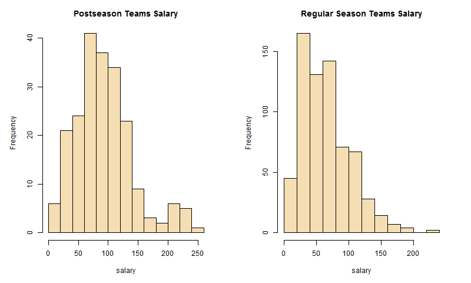
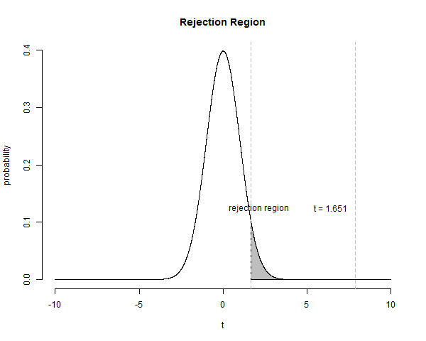
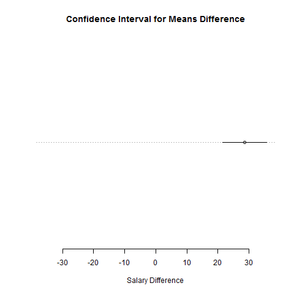

#Hypothesis Testing

In this first example we're going to accomplish 2 things:

* See hypothesis testing in action
* Use R to make the calculations

The example is intentionally easy, so that we can concentrate on the technique, more than on understanding the business logic being it. 
In another section of this website, I'll try to concentrate myself more on business relevant questions and hypothesis.

As we'll always do, we start from the formulation of a relevant question. In this particular case we'll be dealing with
the MLB (Major League Baseball). We'll pretend to be interested in formally answering the question: 

  >*are the teams making the postseason spending more money for players salaries than those who don't?*
  
I know, I know, it's a pretty rhetorical question, but indeed, this is intentional.
To answer it we'll use the History of Baseball data sets provided by Kaggle: it contains a complete history of major league baseball 
stats from 1871 to 2015, just what we need to have some fun with data!

##The method
First of all we state the test hypothesis and set parameters.

Under the **NULL Hypothesis** ($H_{0}$) we state that total amount payed in salaries by the teams who qualify for the playoffs, is the same as those payed by teams who don't qualify for the playoffs, whereas under the  **Alternative Hypothesis** ($H_{a}$) we state that the teams who qualify for the playoffs pay higher salaries. In order to set up these hypothesis we need to divide the population of all MLB teams from 1871 to 2015 into two groups: postseason_teams and regular_season_teams and calculate the average of total salaries for the two groups. These are the quantitative variables that will be used for our hypothesis

  * $H_{0}: \mu_{ps} = \mu_{rs}$
  * $H_{a}: \mu_{ps} > \mu_{rs}$
  
Note: $ps$ = Post Season Teams, $rs$ = Regular Season Teams (didn't make it to the playoffs)

This is going to be right-sided test, because of the Alternative Hypothesis.

We set a **Level of Significance** $\alpha$ for the test of 0.05.

###A comment to the method
In hypothesis testing we start by stating that the NULL Hypothesis is true.

Our goal though is to supply enough evidence in order to demonstrate that it isn't.

The logic behind that is the following: using the sample data that we have at disposition we calculate, by means of the test statistic that we'll see in the next section, how likely it is that we would draw the observed samples from a population if the NULL Hypothesis were true.

If this is very unlikely, than our drawing these two very different samples must not be due to chance or to sampling error, but to a real effect present in the population, so we reject the NULL Hypothesis of equality in favor of the Alternative Hypothesis of inequality of the two groups.

##The Data Preparation
We'll use 3 data sets:

* team.csv: data about all teams for each year
* postseason.csv: data about all postseason teams for each year
* salary.csv: data about salaries for each player, from 1985 to 2015

The preparation steps are essentially three:

1. Calculate adjusted salaries taking the CPI (consumer price index) into account. All salaries will be brought to their equivalent 2015 level

2. Select only the necessary variables from the source files:

    * year
    * team_id
    * name: team name
    * PCT: percentage of victories
    * salary: original salary cap
    * cpi: consumer price index
    * adj_salary: adjusted salary cap to the 2015 consumer price index (in millions of dollars)

3. Divide the teams into two groups: those who qualified for the postseason and those who didn't.

The final data sets should look something like this:

```{r include = FALSE}
source("hypothesis_testing.R")
```

```{r}
head(postseason_teams, 5)
```

##The Test
Once the data sets are ready we start applying the test.

First of all we need to check and see, whether the data have the necessary preconditions to run the test.

The **first condition** is that the **samples are independent** and we will consider them so, even if this may be a bit far fetched.

The **second condition** is that **sampling distributions are approximately normal**. 
We can check that directly, letting R draw the histograms of the two groups (Figure 1).

 

They look normal enough, for the purposes of this demonstration, even if the Regular Season Salary distribution has a right skew.

In order to give NULL and Alternative Hypothesis real numbers, we need the mean salaries of each group, and most importantly their difference.
The statistical test is a comparison of the means between these two groups and an attempt to see if there is enough statistical evidence to conclude that the observed difference is due to an actual effect in the population (of all possible infinite MLB teams), or if it is due to sampling error and chance.

```{r}
mu_ps <- mean(postseason_teams$adj_salary)
mu_rs <- mean(regular_season_teams$adj_salary)
difference <- mu_ps - mu_rs
three_stats <- round(c("Avg. Sal. Postseas" = mu_ps,
                       "Avg. Sal. Regseas" = mu_rs, 
                       "Difference" = difference), 
                     digits = 3)
three_stats
```

The Hypothesis, reformulated are

  * $H_{0}: difference = 0$
  * $H_{a}: difference > 0$

We perform a t-test.

The formula for the test statistic is

$t = \frac{difference}{\sqrt{\frac{sd_{ps}^2}{n_{ps}} + \frac{sd_{rs}^2}{n_{rs}}}} = \frac{difference}{standard\,\,error}$

Here's the evaluation of all required variables

```{r echo = FALSE}
print(paste("Sample size of postseason teams =", nrow(postseason_teams)))
print(paste("Sample size of regular season teams =", nrow(regular_season_teams)))
print(paste("Standard Deviation of postseason teams salary = ", round(sd(postseason_teams$adj_salary), digits = 3)))
print(paste("Standard Deviation of regular season teams salary =", round(sd(regular_season_teams$adj_salary), digits = 3)))
print(paste("Standard Error (Denominator of the formula) =", round(sqrt(((sd_ps^2)/n_ps) +((sd_rs^2)/n_rs)), digits = 3)))
```

Which leads to a t score of

```{r echo = FALSE}
t <- round(difference / se, digits = 2)
t
```

Now there are 3 ways to use this test statistic in order to either reject the NULL Hypothesis in favor of the Alternative Hypothesis, or fail to reject it and thus fail to reach evidence:

1. We calculate a p-value and compare it to the given Level of Significance. If the p-value is less than the Level of Significance, then we reject $H_{0}$, otherwise we fail to reject it.

2. We calculate the cut-off value and see whether our test statistic falls within the rejection region. If it does, then we reject $H_{0}$, otherwise we fail to reject it.

3. We calculate a confidence interval for the difference of the means and see whether it contains the value 0. If it doesn't, then we reject $H_{0}$, otherwise we fail to reject it.

They all lead to the same conclusion and we'll test them all.

##P-value

```{r echo = FALSE}
p_value <- pt(q = t, df = df, lower.tail = FALSE)
if (p_value < alpha) { 
  print(paste("With a p-value of",p_value,"and a Confidence Level of",alpha,": Reject HO")) 
} else { 
  print(paste("With a p-value of",round(p_value, digits = 10),"and a Confidence Level of",alpha,": Do not reject H0")) 
}
```

#Cut-off value

```{r echo = FALSE}
cutoff <- qt(p = (1-alpha), df = df)
if(t > cutoff) { 
  print(paste("With a cut-off value of",round(cutoff, digits = 3),"a right-sided test and a t-value of",t,": Reject HO"))
} else { 
  print(paste("With a cut-off value of",round(cutoff, digits = 3),"a right-sided test and a t-value of",t,": Do not reject H0"))
}

```

We can see graphically in Figure 2 at the end of this document, that the t-value falls in the rejection region



##Confidence interval

```{r echo = FALSE}
t_demi_alpha <- qt(p = (1 - alpha/2), df = df)
lower_bound <- difference - t_demi_alpha * se
upper_bound <- difference + t_demi_alpha * se
confint <- round(c(lower_bound, upper_bound), digits = 3)
if ( (lower_bound <= 0) & (0 <= upper_bound) ) { 
  print(paste("With a 95% Confidence Interval of [",round(lower_bound, digits = 3),",",round(upper_bound, digits = 3),"]: Do not reject HO"))
} else { 
  print(paste("With a 95% Confidence Interval of [",round(lower_bound, digits = 3),",",round(upper_bound, digits = 3),"]: Reject HO"))
} 
```

We can see graphically in Figure 3 at the end of this document, that 0 is indeed not contained in the Confidence Interval, thus allowing us to reject H0.



As was expected, by rejecting the NULL Hypothesis we reach evidence that, indeed, the teams who qualify for the playoffs spend more money on their salary caps.

