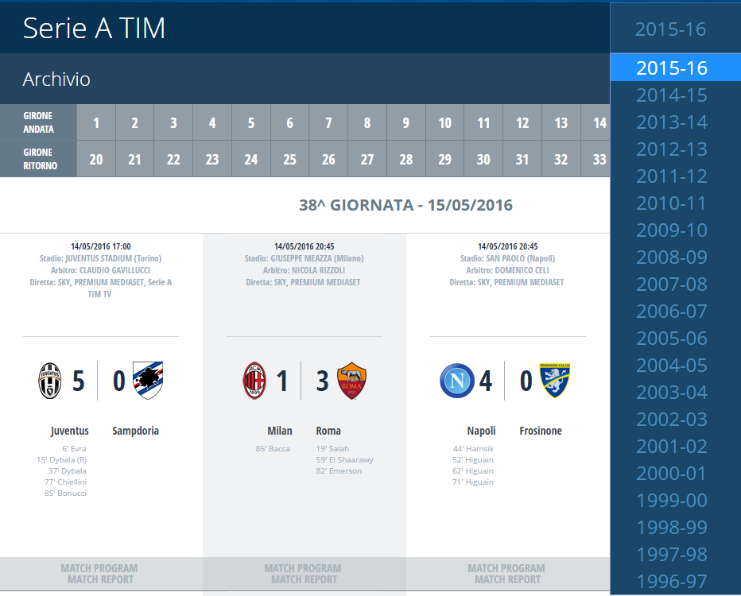
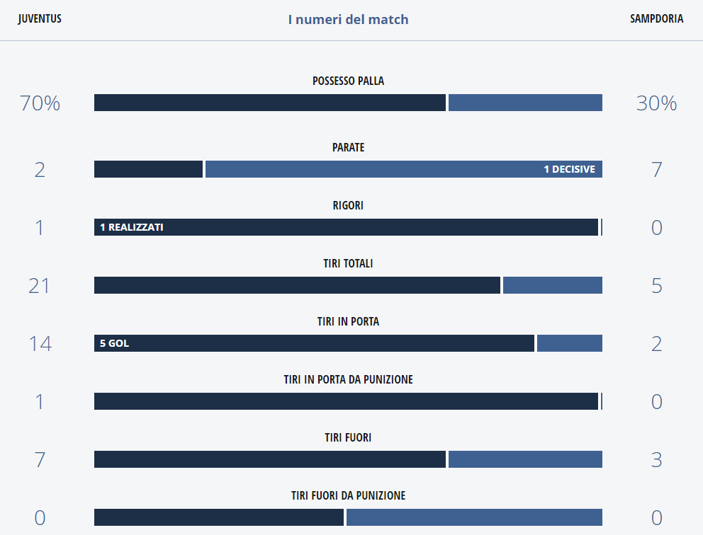

# Project Steps

## Introduction
In this projet I'll try to take a more comprehensive tour on the typical steps of a data science project. Once again I'll use and example from the sport world...I know, I know, this should be my last time for quite some time now and in subsequent articles I'll try to concentrate my attention and apply these techniques to other fields as well.

What I want to accomplish here is to develop a predictive model for soccer results using **logistic regression**. As always I'll need to make some assumptions and some semplifications, because a production ready system would be impossible to develop in a few days. Logistic regression allows us to estimate the probability of a dicothomic event, that is an event that can have 2 possible outcomes: success / failure, won / loss, 1 / 0 and so on.  Soccer has 3 outcomes, because we europeans love our scoreless hard fought games :-).... I'll get around considering losses and draws as "not won" outcomes when fitting the model.

## Project Steps
I have divided the article into different sections, one for each major project steps, as follows:

>1. **Getting the data**: the very first thing that I have to do is get the data that would allow me to build the model. What I want are match statistics data, like shots on goal, shots wide, number of yellow cards, corners, offsides and so on. I've searched the web for quite some time and my first hope was to find a web site with a database of these statistics, but it hasn't been the case, at least no one was satisfactory enough for me. until I bumped into this:

And then this:

and I was like...that is perfect!!! All that I have to do now is write a web scraper to extract that information from this web site and I'm good to go.
