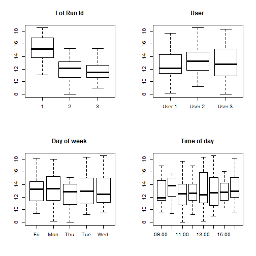
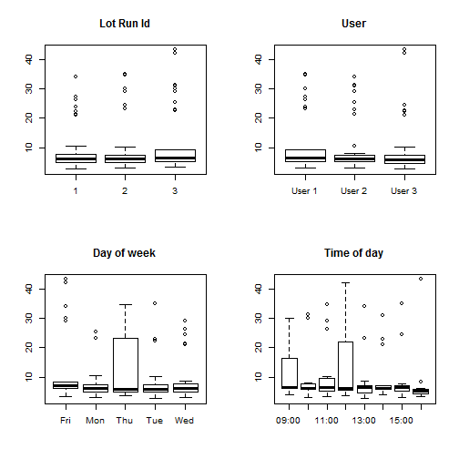
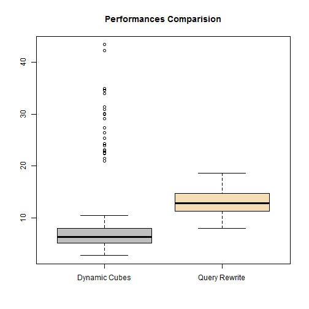

# Oracle Query Rewrite vs IBM Dynamic Cubes
### A Scientifc Approach to Technology Evaluation in IT

## Introduction
In this document I would like to apply the Hypothesis Testing methodology to a use case: the evaluation of 2 different technologies from a performance point of view.

This is something that recently happened in the real life on a customer, and that gave me the possibility to bring a little bit of statistics in the backrooms of an otherwise very conservative IT department.

In order to improve the performances of a set of strategic Dashboards we have been challenged to come up with possible solutions. After an initial assessment, and taking into consideration the specificities of the customer, we selected 2 candidates for the real assessment:
  
  * The Aggregate Awareness Technology from Oracle (Query Rewrite)
  
  * The In-Memory Technology from IBM (Cognos Dynamic CUbes)

One Dashboard has been selected for the implementation with both alternatives. 

After completing the development of the POT (Proof of Technology), we started to make tests in the IT classical way, that is without a clear strategy as to how to make them. 

The results were very conflicting: under certain circumstances Query Rewriter outperformed Dynamic Cubes, under other circumstances it was the other way around. In general we had the impression that Cognos Dynamic Cubes was slightly faster, but again, not always and not always by that much.

In order to be able to establish scientifically which choice was better, if any at all, and by how much qualitatively at least, we had to resort to a more scientifically approach. Put down in statistical terms we had to perform a comparison of 2 different sample means. 

## Data Collection Strategy
The most important point is definitely the data collection strategy: performance data must be gathered in a way such that the samples are representative and independent. 

The most important points to take into consideration are:
  
  1. Gather a sufficient number of cases, so that the samples are significant, in a reasonable amount of time
  
  2. Avoid caching effects from the database
  
  3. Run the dashboard with different users
  
  4. Run the dashboard at different times during the day and at different days of the week
  
  5. Avoid to run the two versions (QR and DC) one after the other to account for independence of the samples


In order to fulfill the requirements of these requirements we made these choices:

  - Each sample contained at least 30 observations, gathered over different sampling windows. Each lot of dashboard run, was made of 3 successive executions
  
  - Between each lot, since it was not possible to clear Oracle's Buffer Cache, we had to schedule at least one hour
  
  - Three users have been used for the tests. Each lot has seen random with possible replacement selection to users, meaning one user can be selected for multiple runs within the same lot
  
  - Runs covered times between 09:00 AM and 16:00 AM East European Time
  
  - Runs were taken from Monday through Wednesday
  
The collected data for the evaluation are available on the repository page.

Here's how they look like.


```
##   day  time    technology   user lot_runid elapsed
## 1 Wed 10:00 Query Rewrite User 3         1    15.7
## 2 Mon 09:00 Query Rewrite User 1         1    16.2
## 3 Fri 14:00 Dynamic Cubes User 3         1     5.2
```

## Dataset Codebook

The dataset contains 6 variables:

  1. **day**: categorical ordinal variable with the string short name of week day
  2. **time**: categorical ordinal variable with the string representation of the time of the day
  3. **technology**: categorical nominal variable with the technology name
  4. **user**: categorical nominal variable with the user Id
  5. **lotid**: quantitative interval variable with the Id of a sample dashboard execution within the same lot
  6. **elapsed**: quantitative ration variable with the elapsed time for the dashboard execution expression in seconds

## Exploratory Data Analysis of the Collected Data

Before presenting our conclusions some exploratory plots, that gave us some interesting inside into the results.

### Query Rewrite
First of all we analyze the data for the Query Rewrite against all available variables.



A very interesting pattern emerges when looking at the lotid plot: the first execution seems to be significantly slower than immediate subsequent executions. This seems easily explained in terms of the caching effect. 

The question for our engineers is now how is it possible to make sure that the necessary data for the dashboard execution get preloaded in the cache, so that we can achieve the average performances of lotid 2 and 3, instead of those of lotid 1?

Since it's not an article on database infrastructure optimization I'll skip on that part as it would probably require an article of its own.

No significant patterns emerge from the other 3 variables.

### Dynamic Cubes
Let's do the same plots for the other technology under evaluation now.



First of all we observe that we don't see that same effect for the lotid variable, as in the previous case.

Each one of the boxplots presents significant outliers, and that will be explained later on in the article. What we interested in now is that there are no significant pattern that we would like to further analyze here.

## Technology Evaluation

It's now time to take a look at the 2 technologies one against the other, and answer the original question of the article: which one is better?

Let's graphically compare the 2 distributions.



Now we see the very interesting and a misleading pattern that brought us to need a statistical approach to decide which technology is better: Dynamic Cubes have a lower median, and even the third quartile of that distribution is at almost the same level as the lower whisker of the Query Rewrite distribution.

But what are those terrible outliers? 
Do they influence our decision?
Can we get rid of them?

### What are those terrible outliers?

Dynamic Cubes is the in-memory offer of IBM for Datawarehouses. By using advanced techniques to populate the server's memory it can speed up by a significant amount reports and dashboards executions against relational data residing in a classical DWH Star Schema (possibly dimensionally modeled to make our life easier).

This memory is used as a cache by the queries generated by the front end tools: every time a report requires data that are already in memory we **hit the cache**, thus saving execution time. When on the contrary the data are not in the cache we than **miss the cache** and DC has to issues slow query to the relational engine, load the data into memory (the cache) and than answer the report.

Those outlier are all **cache misses**.

### Do they influence our decision?

For that we'll run a simple T-Test for the comparison of these two population means.
It's a T test because we don't know the true populations standard deviations and we will estimate them using the sample standard deviations, therefore we have to account for that additional estimation error.

Our NULL Hypothesis (H0) will be that there is no difference in the performances.
Our Alternative Hypothesis (Ha) will be that Dynamic Cubes are faster the Query Rewrite, thus DC < QR from an execution time point of view.
As a level of confidence will choose the classical 95%, or an alpha value of 0.05.


```r
qr <- testdata[which(testdata$technology == "Query Rewrite"),]$elapsed
dc <- testdata[which(testdata$technology == "Dynamic Cubes"),]$elapsed
t.test(x = dc, y = qr, alternative = c("less"))
```

```
## 
## 	Welch Two Sample t-test
## 
## data:  dc and qr
## t = -3.4516, df = 134.69, p-value = 0.0003725
## alternative hypothesis: true difference in means is less than 0
## 95 percent confidence interval:
##      -Inf -1.58342
## sample estimates:
## mean of x mean of y 
##  10.00667  13.05083
```
If we look at the 95 percent confidence interval it has a value of (-Inf -1.58342). 

That means it doesn't contain 0, and the test
has a p-value of 0.0003725, way lower than our alpha value, thus we **reject H0** in favor of **Ha** and can conclude that **Dynamic Cubes is indeed faster than Query Rewrite**.

So no, these outliers are not enough to influence our decision, even if it's again work for us to try to make sure that we can guarantee as a high a cache hit ratio as possible, in order to make the difference even more significant. 

### Can we get rid of them?

We can, and that implies developing the necessary batch processes that can "keep the cache warm", to use IBM's technology, right after the ETL process of the DWH has finished its job, before the users run the dashboard for the first time.

## Conclusion

This method allowed us to give a professional answer to a real world question, without recurring to gut feeling or personal preferences. 

It didn't require us to invest to many resources in terms of time and developers and probably made the client spared some money preventing him from investing in the wrong technology.

It also allowed us not only to establish which technology is better, but also to pinpoint some points that warrants our attention, like Query Rewrite first execution within a run lot and Dynamic Cubes outliers and cache misses, so it opened the field for further performance optimization and improvements being able to assert how important they are quantitatively.
